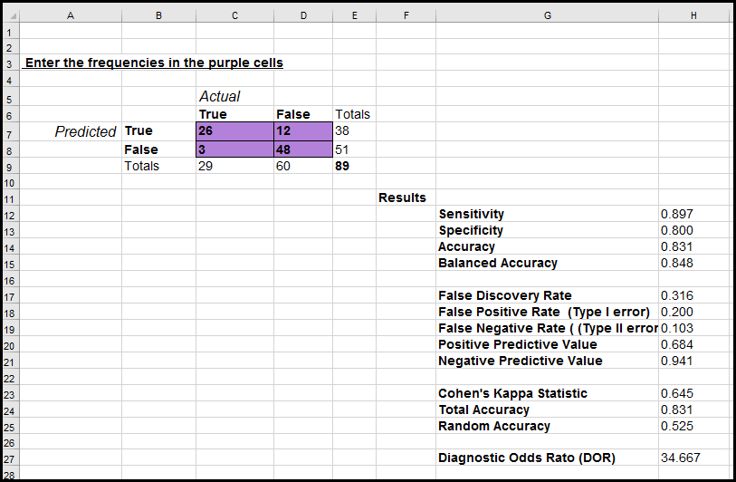

# Confusion_Matrix_Calculator
This Excel worksheet calculates 13 Confusion Matrix statistics including the commonly used Sensitivity, Specificicty, Accuracy and Balanced Accuracy.    

Other calculated statistics are show below.

