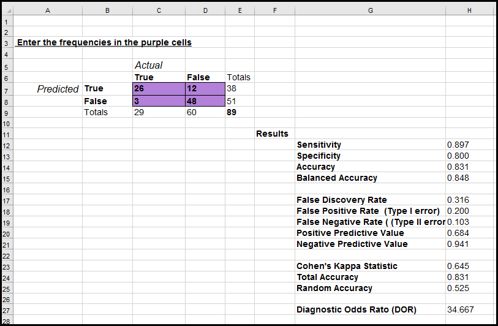
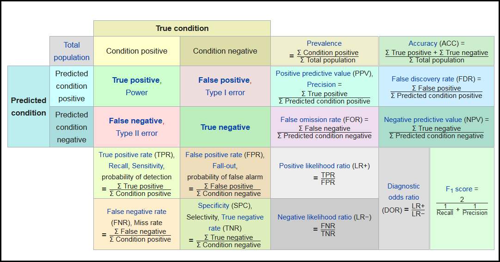
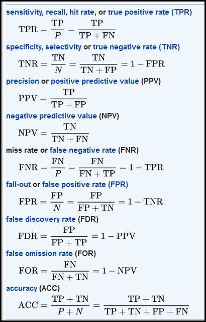

# Confusion Matrix Calculator

A confusion matrix is a summary of predictions based on a classification problem.  The number of correct and incorrect predictions are summarized with count values and broken down by each class.  The Confusion Matrix Calculator is for a two class problem.

The confusion matrix shows the ways in which your classification model is confused when it makes predictions.  

This Excel worksheet calculates 13 Confusion Matrix statistics including the commonly used Sensitivity, Specificity, Accuracy and Balanced Accuracy.  Other calculated statistics are show below.

The formulas used for the statistics are given as shown below.

